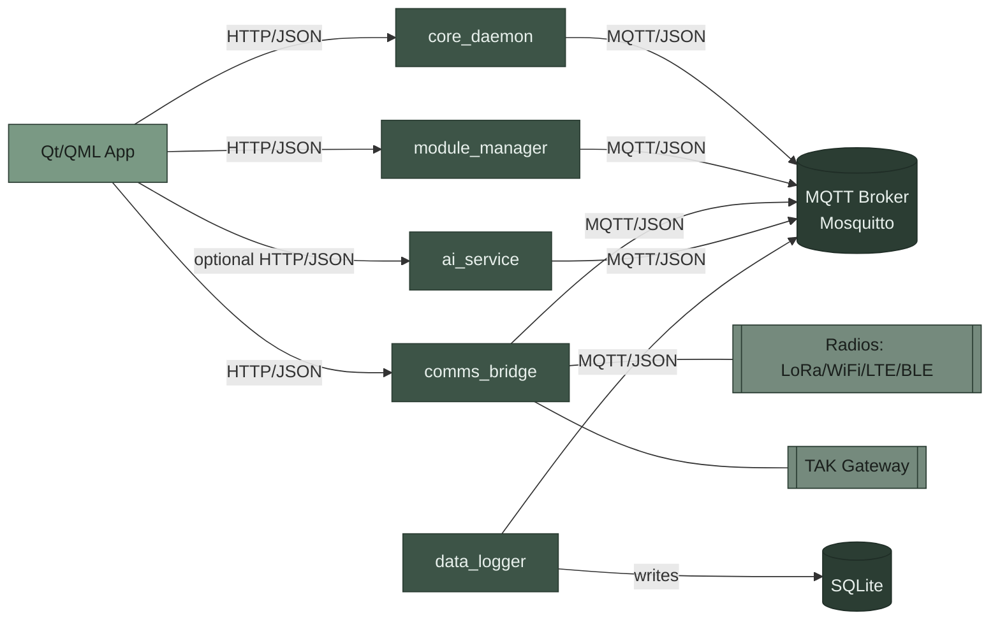

# Architecture Overview

This document provides a detailed overview of Waycore’s software architecture:
services, internal/external communications, third‑party dependencies, UI
guidelines, standards, and extension points.

## System goals

- Reliability in the field using a split‑brain design (Linux SBC + low‑power
  sidecar)
- Communications‑first, modular, and testable without hardware
- Local, on‑device intelligence; cloud‑optional

## High‑level architecture

- UI app (Qt/QML) runs on the Linux SBC and interacts with services via HTTP and
  the internal message bus.
- Core services run as separate processes/containers and communicate over an
  internal MQTT bus:
  - core_daemon: system state machine, power policy, orchestration
  - module_manager: discovery, link protocol, module lifecycle
  - comms_bridge: radio and external gateway integration
  - ai_service: preprocessing and inference runtime with typed I/O
  - data_logger: persistence of selected events (planned/partial)
- Drivers layer provides mock and real hardware implementations behind
  interfaces (HIL).

## Architecture diagram

## Services

- core_daemon
  - Responsibilities: system states, power policy, startup/shutdown, readiness
  - API (dev): FastAPI on 8000; `/health`, `/api/status`, `/api/command`
  - Messages: publishes `system/state/changed`, consumes
    `system/command/execute`
- module_manager
  - Responsibilities: module discovery, framing/protocol, hot‑plug events,
    health
  - API (dev): FastAPI on 8001; `/health`, `/api/modules`
  - Messages: publishes `module/{module_id}/discovered|status|data|removed`,
    consumes `module/{module_id}/command`
- comms_bridge
  - Responsibilities: radio transport coordination, TAK gateway, translation
    between internal schemas and external payloads
  - API (dev): FastAPI on 8003; `/health`, `/api/radios`, `/api/send`
  - Messages: publishes `comms/message/received`, `comms/status/changed`;
    consumes `comms/message/send`
- ai_service
  - Responsibilities: deterministic preprocessing, model runtime abstraction,
    inference
  - API (optional for local RPC/debug): FastAPI
  - Messages: consumes `ai/inference/request`, publishes `ai/inference/response`
- data_logger (scaffold)
  - Responsibilities (planned): subscribe to configured topics, persist records
    with bounded retention

## Internal communication

- Transport: MQTT (paho‑mqtt) running against a Mosquitto broker in development
- Interface: `device.libs.messaging.MessageBus` with `MQTTBus` implementation
- Payload encoding: JSON produced by Pydantic v2 models
- Schemas: `device/libs/schemas/` define all message contracts and topic
  conventions
- Base envelope: `BaseMessage` (fields: `msg_id`, `timestamp`, `source`,
  `version`)
- Topic conventions (selected):
  - System
    - `system/state/changed` → `SystemStateChanged`
    - `system/command/execute` → `SystemCommand`
  - Comms
    - `comms/message/received` → `MessageReceived`
    - `comms/message/send` → `SendMessageRequest`
    - `comms/status/changed` → `CommsStatusChanged`
  - Modules
    - `module/{module_id}/discovered` → `ModuleDiscovered`
    - `module/{module_id}/status` → `ModuleStatus`
    - `module/{module_id}/data` → `ModuleData`
    - `module/{module_id}/removed` → `ModuleRemoved`
    - `module/{module_id}/command` → `ModuleCommand`
  - Sensors
    - `sensor/gps/position` → `GPSPosition`
    - `sensor/{sensor_id}/status` → `SensorStatus`
    - `sensor/{sensor_id}/data` → `SensorData`
  - AI
    - `ai/inference/request` → `AIInferenceRequest`
    - `ai/inference/response` → `AIInferenceResponse`

Notes:

- Topics listed above are enforced by the schema docs and used across services.
- Services must validate inputs against the shared Pydantic types before
  publish/consume.

## Service APIs (HTTP)

- Framework: FastAPI + Uvicorn
- Content type: JSON; typed request/response models where applicable
- Standard endpoints:
  - `GET /health` returns service health/uptime
  - Minimal operational APIs exposed for local tools (e.g., `/api/send`,
    `/api/status`)
- Development ports:
  - core_daemon: 8000
  - module_manager: 8001
  - comms_bridge: 8003

## Data storage

- Backend: SQLite via `aiosqlite` wrapper (`device/libs/database/sqlite.py`)
- Mode: WAL enabled; simple append‑only tables
- Tables:
  - `events(topic, payload, ts)` for arbitrary bus events
  - `comms_messages(transport, from_node, to_node, content, channel, rssi, snr, metadata, ts)`
  - `ai_inferences(request_id, model_id, inference_type, success, results, error_message, ts)`
- Retention: implemented by consumer policy (future work: rotation/retention
  enforcement)

## AI architecture

- Types supported: `image_classification`, `object_detection`, `qa`
- Pipeline:
  1. Request normalized and validated (`AIInferenceRequest`)
  2. Deterministic preprocessing (`preprocessing.py`)
  3. Model runtime selected by `model_id` via registry (`models/runtime.py`)
  4. Results mapped to `AIInferenceResponse`
- Deterministic fallback logic exists for development to avoid heavy deps.
- Model backends (planned/optional):
  - ONNX Runtime (CPU/NPU where available)
  - TensorFlow Lite
  - OpenCV/DNN
- Configuration: model mapping in
  `device/services/ai_service/models/config/models.yaml`

## UI guidelines and standards

- Stack: Qt/QML with a shared Theme singleton (`device/apps/ui/qml/Theme.qml`)
- Palette (dark): primary `#2B3D33`, secondary `#7A9984`, semantic colors for
  success/warning/error/info
- Typography: `h1=32`, `h2=24`, `body=14`
- Spacing scale: `4, 8, 16, 24`
- Minimum touch target: `48`
- Components live under `device/apps/ui/qml/components/`
- Principles:
  - Motion and rendering must not block IO; keep the UI reactive and
    message‑driven
  - Prefer large touch targets and high contrast for outdoors
  - Keep critical system state (battery, radios, SOS) visible or one tap away
  - Respect single source of truth from schemas for data shapes

## Third‑party dependencies

Core runtime:

- FastAPI: service HTTP APIs
- Uvicorn (standard extras): ASGI server
- Pydantic v2: schemas and validation
- paho‑mqtt: MQTT client
- aiosqlite: async SQLite access
- httpx: internal HTTP client (where needed)
- PyYAML: configuration loading

Dev/test/tooling:

- pytest, pytest‑asyncio, pytest‑cov, pytest‑mock, hypothesis
- ruff, black, mypy, pre‑commit

AI (optional/planned by model choice):

- onnxruntime / tflite‑runtime / opencv‑python

## Configuration and environment

- Each service reads YAML config from its `config/` folder
- Environment variables override deployment‑specific or sensitive values
- MQTT broker URL passed to services via config/env

## Deployment (development)

- Docker Compose brings up Mosquitto (MQTT) and core services
- Example (see `docker/compose/dev.yml`):
  - `mqtt` (Mosquitto)
  - `core-daemon`, `module-manager`, `comms-bridge`
- Health checks exposed on localhost ports as listed above

## Standards and conventions

- Messaging:
  - All inter‑service messages must use the shared Pydantic schema types
  - Topic names must follow the schema docstrings
  - Backpressure/rate limits must be respected for radio links
- Errors:
  - Use typed error responses; never drop correlation IDs
    (`msg_id`/`request_id`)
  - Avoid raising exceptions from bus callbacks (errors should be handled or
    reported)
- Code quality:
  - Type‑checked (`mypy --strict`), formatted (`black`), linted (`ruff`)
  - Unit tests for schemas/HIL/messaging; service tests per service package
- API:
  - JSON only, standard HTTP codes, `GET /health` required
  - Keep operational APIs minimal; prefer bus for internal workflows

## Security and privacy

- Local‑first design; no cloud dependency by default
- Secrets via environment variables; never commit credentials
- Validate and sanitize all external inputs (radio/gateway)
- Enforce payload size limits (e.g., LoRa constraints in `comms` schemas)
- Rate‑limit external bridges to protect the internal bus

## Extensibility

- Add a new message type:
  1. Define Pydantic model under `device/libs/schemas/`
  2. Document topic in the model docstring
  3. Publish/consume via `MessageBus` using the new type
- Add a new service:
  1. Create `device/services/{name}` with `service.py`, `api.py`, `config/`,
     `tests/`
  2. Wire to MQTT via `MessageBus`
  3. Expose `GET /health`; keep APIs minimal
- Add a new module or radio:
  1. Implement driver behind HIL interface in `device/libs/hil/` (or driver
     package)
  2. Keep protocol specifics localized; publish typed events to the bus

## References

- Repository layout and vision: `README.md`, `docs/overview.md`
- Shared schemas: `device/libs/schemas/`
- Services: `device/services/*`
- UI: `device/apps/ui/`
- Development with Docker: `docs/local_dev_docker.md`
